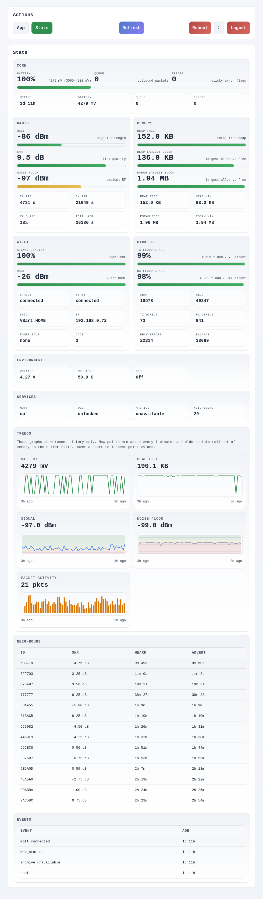
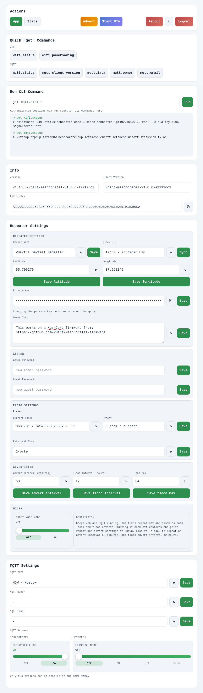

# Heltec V4 Web Monitor

Прошивка MeshCore-репитера для высокомощной Heltec WiFi LoRa 32 V4/V4.3 с локальной веб-панелью, монитором пакетов, картой узлов и поддержкой [MeshCoreTel](https://meshcoretel.ru/).

Проект основан на [VBart/MeshCoreTel-firmware](https://github.com/VBart/MeshCoreTel-firmware), который, в свою очередь, развивает [MeshCore-EastMesh](https://github.com/xJARiD/MeshCore-EastMesh) и заменяет поддержку EastMesh AU на MeshCoreTel. Изменения этого репозитория сосредоточены на веб-мониторинге и управлении Heltec V4.

В основе лежат официальные версии [MeshCore](https://github.com/meshcore-dev/MeshCore). Благодарность Scott Powell / Ripple Radios и всем контрибьюторам MeshCore за оригинальную прошивку, Jared Dohrman за EastMesh и VBart за интеграцию MeshCoreTel и базовую веб-панель.

## Ключевые особенности прошивки

### Дополнения ретранслятора

- поддержка Wi-Fi в клиентском режиме
- автонастройка сети через DHCP
- синхронизация времени по NTP
- поддержка MQTT-брокеров:
  - `meshcoretel`
  - `letsmesh-eu`
  - `letsmesh-us`
- транспорт plain TCP и WSS по пути `/mqtt`
- JWT-аутентификация с использованием идентификации устройства для WSS
- CLI-команды для:
  - учётных данных WiFi
  - энергосбережения WiFi
  - отчётов о заряде батареи на поддерживаемых платформах
  - включения конечной точки MQTT
  - отправки пакетов MQTT и публикации сырых данных
  - публичного ключа владельца и адреса электронной почты
  - включения локальной веб-панели
  - управления вентилятором на TBeam 1W
  - включения и отключения внешнего LNA на Heltec v4.3
- все сетевые процессы (включая обработку MQTT и веб-панели) вынесены на отдельное ядро и не вносят задержек в обработку LoRa-пакетов и функционирование ретранслятора 

### Локальная веб-панель

Дополнительно на поддерживаемых устройствах (с достаточным количеством памяти) ретранслятор может предоставлять локальную панель конфигурации по HTTPS через WiFi.

#### Возможности:

- доступ по паролю, используя существующий административный пароль ретранслятора
- выполнение CLI-команд
- изменение основных настроек репитера и MQTT через веб-интерфейс
- сгруппированные быстрые действия
- вся ключевая статистика по репитеру
- список последних услышанных соседей с показателями качества сигнала
- хранение истории показателей за последние несколько часов (только на устройствах с PSRAM)
- живой монитор RX/TX-пакетов с фильтрами, CSV-экспортом и подробной карточкой метаданных
- карта проверенных advert-узлов и трёхсекундная визуализация движения пакетов
- выбор координат репитера точкой на карте
- настройка аппаратно ограниченной выходной мощности передатчика на поддерживаемых платах
- безопасное обновление прошивки по HTTPS
- подгружаемые через API радио-пресеты и IATA-коды
- светлая и тёмная темы
- возможность отключения командой `set web off`
- адаптация для мобильных устройств

Подробнее в документации: [Использование веб-панели ретранслятора](https://enotikov.github.io/heltec-v4-web-monitor/web-panel/)

### Расширенная сборка Heltec V4

Для высокомощной Heltec WiFi LoRa 32 V4/V4.3 с OLED доступна расширенная страница `/packets`:

- кольцевой журнал 128 последних RX/TX/TX-failed записей без сохранения зашифрованного payload;
- подробности пакета по нажатию на строку;
- проверенные узлы только из корректно обработанных advert;
- до 128 точек, сохраняемых в RAM до перезагрузки без вытеснения ранее найденных узлов;
- линии пакетов длительностью три секунды;
- фиксированный пользователем масштаб карты после первого автоматического обзора;
- оценочная выходная мощность высокомощной платы `3…28 dBm` без встроенного регионального ограничения.

Полное руководство, ограничения и инструкции по OTA/USB: [Heltec V4: веб-панель и монитор пакетов](https://enotikov.github.io/heltec-v4-web-monitor/heltec-v4-web-monitor/).

### Веб-API по HTTPS

На устройствах с поддержкой веб-панели также возможно использование встроенного API по Wi-Fi.

#### Возможности:

 - авторизация по паролю администратора с получением временного токена
 - выполнение любых CLI-команд для управления, настройки и статуса
 - получение всей доступной телеметрии

Данный API может быть использован для мониторинга с хранением долгосрочной истории (например с использованием таких инструментов как Prometheus и Grafana), а также автонастройки и управления устройством с помощью скриптов.

Подробнее в документации: [Использование веб-API ретранслятора](https://enotikov.github.io/heltec-v4-web-monitor/api/)

## Релизы

Готовые прошивки публикуются на GitHub Releases:

- <https://github.com/enotikov/heltec-v4-web-monitor/releases>

Сборки upstream также доступны в веб-прошивальщике MeshCoreTel:

- <https://meshcoretel.ru/ru/flasher> (раздел прошивок VBart; наличие именно этой расширенной сборки необходимо проверять по названию и версии)

## Документация

- <https://enotikov.github.io/heltec-v4-web-monitor/>

Основные разделы пользовательского руководства:

- [Сравнение устройств](https://enotikov.github.io/heltec-v4-web-monitor/boards/)
- [Загрузка и прошивка релизов](https://enotikov.github.io/heltec-v4-web-monitor/releases/)
- [Heltec V4: веб-панель и монитор пакетов](https://enotikov.github.io/heltec-v4-web-monitor/heltec-v4-web-monitor/)
- [Использование веб-панели ретранслятора](https://enotikov.github.io/heltec-v4-web-monitor/web-panel/)
- [Использование веб-API ретранслятора](https://enotikov.github.io/heltec-v4-web-monitor/api/)
- [Пользовательские команды CLI](https://enotikov.github.io/heltec-v4-web-monitor/custom-cli/)
